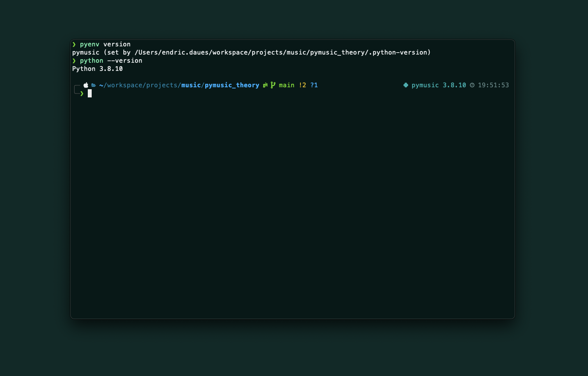

<div style="text-align: center;">
<h1>Music Theory in Python
</div>

<div style="text-align: center;">
    
    <p align="center"></p>
</div>

## TL;DR

This repo is a collection of Python classes and notebooks I wrote to help me learn music theory. I read [Music by the Numbers](https://press.princeton.edu/books/paperback/9780691202969/music-by-the-numbers) and [Twenthieth Century Harmony](https://wwnorton.com/books/9780393095395) before implementing this. I was looking for a way to build some intuitions around the theory independently of playing an instrument. This seemed to be the best approach.  This code is intended to be used to generate triads, scales, chords, chord progressions. If I want to generate a complex 2-5-1 based Jazz progression, this code should let me do it with a couple function calls. The generated visualizations of scales, triads, chords, etc. are geared towards piano and electric guitar. Current features include:
* Build notes, scales, triads.
* Visualize the fretboard and notes, scales, triads.
* Generate scales in music notation.

I recommend interacting with the code through a Python notebook. Check out `runner.ipynb` for an overview.

## Installation

### Python Environment

I utilize [PyEnv](https://github.com/pyenv/pyenv) with [virtualenv](https://github.com/pyenv/pyenv-virtualenv) to manage my Python distributions.

<div style="text-align: center;">
    
    <p align="center"></p>
</div>

This project requires the following packages, which can be installed through pip.

```
# requirements.txt
attrdict
svgwrite
pyyaml
PIL
```
`pip install -r requirements.txt`

Also, to utilize the notation class, you will want to instal lilypond, which seems to be a standard tool for music notation.

`brew install lilypond`


## Pythonic Concepts

I tried to use this project to explore some deeper Python concepts. The situation at hand lends itself nicely to an object-oriented programming approach, hence the heavy use of classes and inheritance. Classes can be manipulated in useful ways in Python. I tried to use generators where they seemed useful, and want to implement a decorator on a method returning a scale or something - maybe to transpose?

Note that I have removed the docstrings from classes I am explaining here, they are preserved in the code.


### Notes

Ultimately, the goal is to make this library work entirely on note frequencies, but currently, I am still maintaining one or two cases where the name of the note is utilized.

The note class is parameterized by a note name (C, D, D#, Eb, etc.) and a frequency. 

```
class Note:
    def __init__(self, name: str, pitch: float):
        self.name: str = name
        self.pitch: float = pitch

    def __str__(self):
        return f"Note(name='{self.name}', pitch={self.pitch:.0f})"

    def __eq__(self, other):
        return round(self.pitch, 0) == round(other.pitch, 0)

    def __ne__(self, other):
        return not self.__eq__(other)

    def __hash__(self):
        return hash((self.name, round(self.pitch, 0)))
```
The equality method and its negation ensure that equality between notes is determined by pitch, not name. The has method allows use of class instances as keys in dictionaries. This can be super helpful when you want to store useful information associated with a note. I have started to really like this print format, since it allows you to copy the printed string and paste it into a cell where you can run it.

I utilized the following formula to compute the pitch of a note given the interval distance, which is based on the equal-tempered scale:

```
@abstractmethod
def get_pitch(self, pitch: float, interval: int) -> float:
    return ((2 ** (1 / 12)) ** interval) * pitch
```

This is discussed on Page 72 in [Music by the Numbers](https://press.princeton.edu/books/paperback/9780691202969/music-by-the-numbers). Utilizing this method to retrieve notes based on interval multiples of the base interval in the equal-tempered scale is a great core engine for this library. I try to base any calculations, such as computing triads or chords, on this formula. You can utilize one of these MIDI charts for looking up frequencies for instruments such as a piano.

### Scales

Scales implement a list of notes. Given a base note and a list of intervals, initiating the scale class will generate an array of notes that can be iterated over. Again, we utilize the `get_pitch` method to compute the next note.

```
class Scale:
    def __init__(self, name: str, base_note: Note, intervals: List[int]) -> List[Note]:
        self.name: str = name
        self.base_note: Note = base_note
        self.intervals: List[int] = intervals
        self.notes: List[Note] = [self.base_note]
        self.generate_scale()

    def generate_scale(self):
        theory = TheoryMaster()
        current_note = self.base_note
        current_index = theory.notes.index(self.base_note.name)

        for interval in self.intervals[:-1]:
            next_pitch = theory.get_pitch(current_note.pitch, interval)
            current_index += interval
            next_note = Note(theory.notes[current_index % 12], next_pitch)
            self.notes.append(next_note)
            current_note = next_note

    def __getitem__(self, index: int):
        return self.notes[(index - 1) % len(self.notes)]

    def __iter__(self):
        return iter(self.notes)

    def __str__(self):
        return f"{[str(note) for note in self.notes]}"
```
Not that the get method facilitates indexing by the scale integer, not zero indexing, hence the `-1`.

### Triads

Triads are lists of intervals based on some tonal center. Given a scale and a list of intervals, we just need to generate the correct notes. However, there are inversions of triads, and our implementation looks to make inversion-handling as simple as possible.

To handle all music theory core concepts, I made a `TheoryMaster` class, which contains all of the methods that are used frequently enough to include them year, yet are not properties of classes such as a scale. These methods here are part of that class.

To handle the inversions, we separate the interval to note lookup from the interval selection, which is where the inverting happens. The lookup is simple enough:

```
def get_triad(
    self,
    note: Note,
    intervals: List[int],
) -> List[Note]:
    return [
        Note(
            self.notes[(self.notes.index(note.name) + interval) % 12],
            self.get_pitch(note.pitch, intervals[i]),
        )
        for i, interval in enumerate(intervals)
```
So far the intervals are hardcoded in `get_triad_intervals`, but I am working on how to generate them more naturally. To handle the inversion, we just implement the method exactly as it happens in the theory: remove the base note and add it to the top (plus one octave).

```
@abstractmethod
def invert(self, intervals: List[int], n: int):
    for i in range(n):
        base = intervals.pop(0) + 12
        intervals.append(base)

    return intervals
```

## Instruments

The instrument base class defines the initiate and play class. The notes propert is initialized, and the play method returns the keys The notes property maps a note to a list of keys where this note can be played.

```
class Instrument:
    def __init__(self, name: str):
        self.name = name
        self.notes: Dict[Note, List[int]] = {}

    @abstractmethod
    def _initiate(self):

    @abstractmethod
    def play(self, notes: List[Note]) -> List[int]:
```

So far I have implemented the Guitar and Piano class. The Guitar class can be visualized nicely with the `python-fretboard` library.

## Musical Analysis

I want to use this code in part to deep dive into some calculations that might clutter the overall structure of this code. Therefore, I chose to separate out the `GuitarAnalyzer` class for visuals, finger positioning calulcations, as well as note indexing. There is still a lot of work in progress here, for example testing an euclidean distance approach to optimal finger positions. I also want to start looking into overtones and computing consonance between notes/chords.

## Runbook

I would suggest walking through `runner.py`, I have tried to demo all the functionalities there.

### Generate Scales

Using the MIDI chart to lookup a C, we can easily generate a scale.

```
theory = TheoryMaster()

c = Note("C", 261.63)
c_major_scale = Scale("c_major", c, theory.major_intervals)
print(c_major_scale)
```
Generates

```
>>["Note(name='C', pitch=262)", "Note(name='D', pitch=294)", "Note(name='E', pitch=330)", "Note(name='F', pitch=349)", "Note(name='G', pitch=392)", "Note(name='A', pitch=440)", "Note(name='B', pitch=494)"]
```

### Generate Triads

We can also pass a triad interval by retrieving it from the theory class.

```
# major triad
c = Note("C", 261.63)
major_triad_intervals = theory.get_triad_intervals("major")
print(major_triad_intervals)

triad = theory.get_triad(c, major_triad_intervals)
[print(note) for note in triad]
```

which returns

```
>>[0, 4, 7]
>>Note(name='C', pitch=262)
>>Note(name='E', pitch=330)
>>Note(name='G', pitch=392)
```

As mentioned, this implementation facilitates inversions:

```
# major triad first inversion
c = Note("C", 261.63)
major_triad_intervals = theory.get_triad_intervals("major", inversion=1)
print(major_triad_intervals)

triad = theory.get_triad(c, major_triad_intervals)
[print(note) for note in triad]
```

Which I find make them very intuitive:

```
>>[4, 7, 12]
>>Note(name='E', pitch=330)
>>Note(name='G', pitch=392)
>>Note(name='C', pitch=523)
```

### Initialize Instruments

#### Piano

Currently just supports initialization and playing.

```
piano = Piano(88, Note("A", 27.5))

# middle A
print(f"Middle A: {piano.keys[4*12]}")

# all keys
for i in range(len(piano.keys)):
    print(piano.keys[i])
```
Returns
```
>>Middle A: Note(name='A', pitch=440)
>>Note(name='A', pitch=28)
>>Note(name='Bb', pitch=29)
>>Note(name='B', pitch=31)
>>Note(name='C', pitch=33)
>>...
```

#### Guitar

The guitar is also super simple to initialize in any tuning:

```
standard_tuning = [
    Note("E", 82.41),
    Note("A", 110.00),
    Note("D", 146.83),
    Note("G", 196.00),
    Note("B", 246.94),
    Note("E", 329.63)
]

guitar = Guitar(frets=14)
analyzer = GuitarAnalyzer(guitar)
```

The guitar returns the key numbers that can produce the pitch.

```
# play major triad second inversion
strum_guitar = guitar.play(triad)
print(strum_guitar)
```
```
>>>[[54, 64, 73], [69, 78], [82]]
```

And we can convert these into string/fret coordinates, and process these to return some optimal configuration - I am still figuring out the details here

#### Fretboard Visuals

Finally, we can put triads, the guitar, and the `python-fretboard` library together to produce some fretboard diagrams:

```
# E Major scale
e = Note("E", 82.41)
e_major_scale = Scale("e_major", e, theory.major_intervals)
e_major_scale_coords = list(analyzer.get_equivalence_classes(e_major_scale))

path = "/Users/endric.daues/workspace/projects/music/pymusic_theory/images/fretboard/e_major_scale.svg"
analyzer.visualize_fretboard(e_major_scale_coords, path, frets=(0,22), color="navy", )
```
Which produces

<div style="text-align: center;">
    
    <p align="center"></p>
</div>